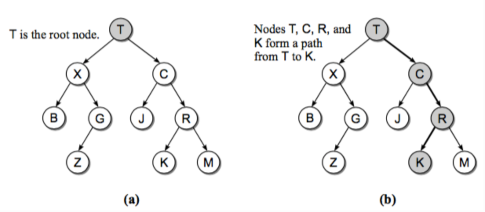
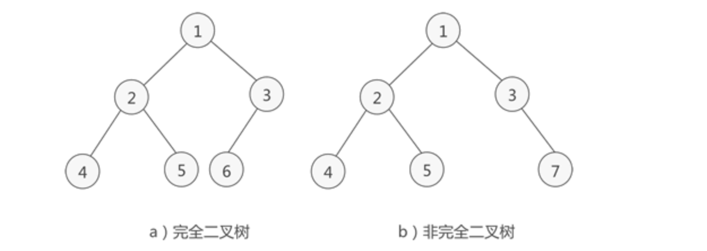
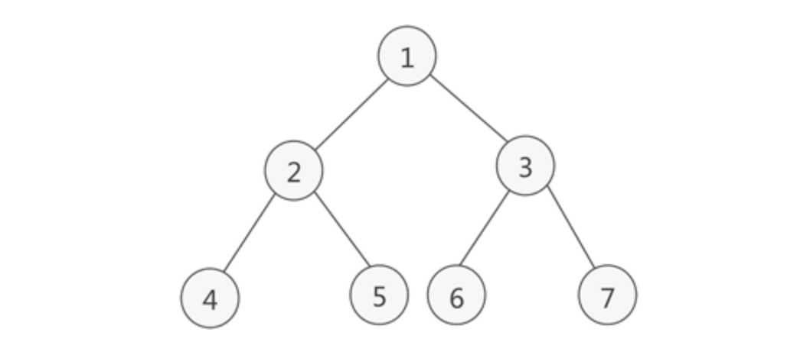
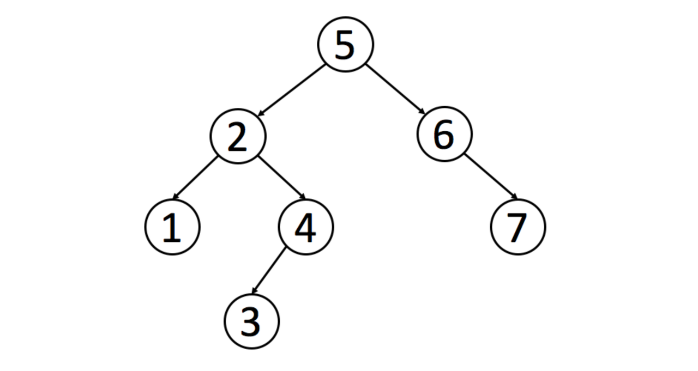
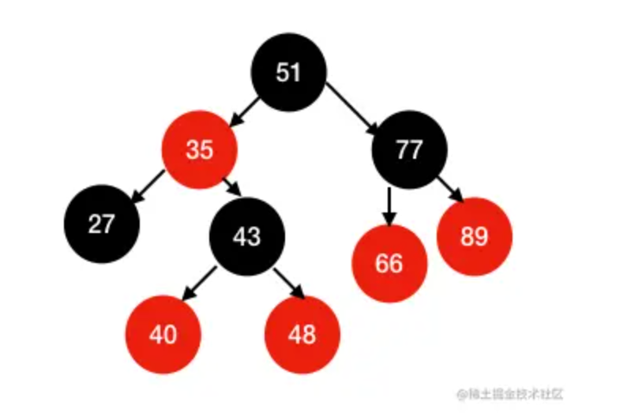
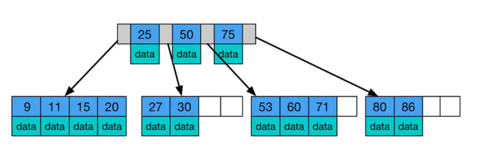
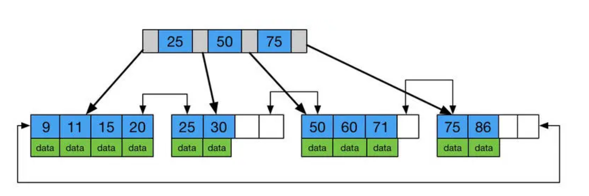

<!-- START doctoc generated TOC please keep comment here to allow auto update -->
<!-- DON'T EDIT THIS SECTION, INSTEAD RE-RUN doctoc TO UPDATE -->
**Table of Contents**  *generated with [DocToc](https://github.com/thlorenz/doctoc)*

- [:point_right:概念简介](#point_right%E6%A6%82%E5%BF%B5%E7%AE%80%E4%BB%8B)
- [二叉树种类](#%E4%BA%8C%E5%8F%89%E6%A0%91%E7%A7%8D%E7%B1%BB)
  - [普通二叉树](#%E6%99%AE%E9%80%9A%E4%BA%8C%E5%8F%89%E6%A0%91)
  - [完全二叉树](#%E5%AE%8C%E5%85%A8%E4%BA%8C%E5%8F%89%E6%A0%91)
  - [满二叉树](#%E6%BB%A1%E4%BA%8C%E5%8F%89%E6%A0%91)
  - [:point_right:二叉搜索树](#point_right%E4%BA%8C%E5%8F%89%E6%90%9C%E7%B4%A2%E6%A0%91)
    - [code-golang](#code-golang)
    - [code-python](#code-python)
  - [:point_right:AVL平衡二叉树 -- 细品](#point_rightavl%E5%B9%B3%E8%A1%A1%E4%BA%8C%E5%8F%89%E6%A0%91----%E7%BB%86%E5%93%81)
  - [:point_right:红黑树](#point_right%E7%BA%A2%E9%BB%91%E6%A0%91)
  - [:point_right:B树和B+树](#point_rightb%E6%A0%91%E5%92%8Cb%E6%A0%91)
- [:point_right:二叉树遍历](#point_right%E4%BA%8C%E5%8F%89%E6%A0%91%E9%81%8D%E5%8E%86)
    - [:point_right:code-golang](#point_rightcode-golang)
    - [:point_right:code-python](#point_rightcode-python)

<!-- END doctoc generated TOC please keep comment here to allow auto update -->

# :point_right:概念简介

树结构是一种包括节点(nodes)和边(edges)的拥有层级关系的一种结构

二叉树是一种简单的树，它的每个节点最多只能包含两个孩子。



- 根节点(root): 树的最上层的节点，任何非空的树都有一个节点
- 路径(path): 从起始节点到终止节点经历过的边
- 父亲(parent)：除了根节点，每个节点的上一层边连接的节点就是它的父亲(节点)
- 孩子(children): 每个节点由边指向的下一层节点
- 兄弟(siblings): 同一个父亲并且处在同一层的节点
- 子树(subtree): 每个节点包含它所有的后代组成的子树
- 叶子节点(leaf node): 没有孩子的节点成为叶子节点

# 二叉树种类

## 普通二叉树

每个节点最多有两个子节点，左子节点和右子节点。

## 完全二叉树

完全二叉树是一种特殊的二叉树，除了最后一层节点可以不满，其他层节点都必须是满的二叉树。在完全二叉树中，最后一层节点从左向右排列，不留空缺。



> 完全二叉树具有一些特殊的性质，可以用于设计一些高效的数据结构，例如堆、哈希表等，也可以用于一些算法的优化，例如二分查找、贪心算法等。

## 满二叉树

满二叉树是一种特殊的二叉树，除了叶子节点，每个节点都有两个子节点，且所有叶子节点都在同一层。



> 满二叉树的节点数目比普通二叉树更为确定，因此可以在一些需要确定节点数目的场合使用满二叉树。例如，满二叉树可以用于设计哈夫曼树、B树等数据结构，还可以用于算法的优化，例如二分查找、堆排序等。

## :point_right:二叉搜索树

二叉搜索树（Binary Search Tree，简称BST）是一种二叉树，其中每个节点都包含一个键值，且对于每个节点，其左子树中的所有节点的键值都小于该节点的键值，右子树中的所有节点的键值都大于该节点的键值。

二叉搜索树的特点：

1. 左子树中的所有节点的键值都小于根节点的键值。
2. 右子树中的所有节点的键值都大于根节点的键值。
3. 左右子树也分别是二叉搜索树。
4. 没有重复的节点。



> 中序遍历得到一个递增的有序序列。因此，中序遍历是二叉搜索树中最常用的遍历方法。
>
> 二叉搜索树的查找、插入和删除操作的时间复杂度都为O(log n)，其中n为节点数目。但是如果二叉搜索树退化为链表，那么操作的时间复杂度就会退化为O(n)。因此，在实际应用中，需要考虑如何避免二叉搜索树的退化，例如可以使用平衡二叉树等数据结构。

### code-golang

```Go

```

### code-python

```Python

```

## :point_right:AVL平衡二叉树 -- 细品

平衡二叉树（Balanced Binary Tree），也称为AVL树，是一种二叉搜索树，其左右子树的高度差不超过1，即任意节点的左右子树的高度差的绝对值不超过1。

平衡二叉树的一个重要特点是，它可以保证在最坏情况下，查找、插入和删除操作的时间复杂度都是O(log n)，其中n为节点数目。

```Bash
          5
        /   \
       2     7
      / \     \
     1   4     8
            /   \
           6     9
```

平衡二叉树的旋转操作有两种：

1. 左旋：将节点的右子树变为其父节点，同时节点成为其右子树的左子树。

```Bash
# 右树左旋
      a
       \
        b
         \
          c

      b
     / \
    a   c
```

1. 右旋：将节点的左子树变为其父节点，同时节点成为其左子树的右子树。

```Bash
# 左树右旋转
     c
     /
    b
   /
  a

      b
     / \
    a   c
```

## :point_right:红黑树

红黑树（Red-Black Tree）是一种自平衡二叉搜索树，它的每个节点上都带有一个存储位表示节点的颜色，可以是红色或黑色。

红黑树的每个节点都满足以下性质：

1. 节点是红色或黑色。
2. 根节点是黑色。
3. 每个叶子节点（NIL节点，空节点）是黑色的。
4. 如果一个节点是红色的，则它的两个子节点都是黑色的。
5. 对于每个节点，从该节点到其所有后代叶子节点的简单路径上，均包含相同数目的黑色节点。



红黑树的性质保证了它的最长路径不会超过最短路径的两倍，因此红黑树的查找、插入和删除操作的时间复杂度都是O(log n)，其中n为节点数目。

## :point_right:B树和B+树

B树（Balance-tree）是一种自平衡的多路搜索树，常用于实现数据库和文件系统等数据存储系统中的索引结构。

B树将数据存储在节点上而非叶子节点上，每个节点可以存储多个关键字和指向子节点的指针。

一棵B树的基本特征如下：

1. 每个节点最多有m个子节点。
2. 除根节点和叶子节点外，每个节点至少有ceil(m/2)个子节点。
3. 所有的叶子节点都在同一层。
4. 每个节点中的关键字按照从小到大的顺序排序。



B+树是B-树的变体，也是一种多路搜索树, 它与 B- 树的不同之处在于:

1. 所有关键字存储在叶子节点出现,内部节点(非叶子节点并不存储真正的 data)
2. 为所有叶子结点增加了一个链指针



# :point_right:二叉树遍历

- `前序遍历`: 按照“根节点-左子树-右子树”的顺序遍历二叉树。
- `中序遍历`: 按照“左子树-根节点-右子树”的顺序遍历二叉树。
- `后续遍历`: 按照“左子树-右子树-根节点”的顺序遍历二叉树。
- `层序遍历`: 层序遍历是一种广度优先搜索（BFS）的应用，它遍历二叉树的每一层节点，从上到下、从左到右依次访问。

### :point_right:code-golang

```Go
package main

import (
    "fmt"
)

type TreeNode struct {
    Val   int
    Left  *TreeNode
    Right *TreeNode
}

// preorderTraveral 前序遍历
// 根结点-左节点-右节点
func preorderTraversal(node *TreeNode) {
    if node == nil {
        return
    }
    fmt.Println(node.Val)
    preorderTraversal(node.Left)
    preorderTraversal(node.Right)
}

// inorderTraversal 中序遍历
// 左节点-根结点-右节点
func inorderTraversal(node *TreeNode) {
    if node == nil {
        return
    }
    inorderTraversal(node.Left)
    fmt.Println(node.Val)
    inorderTraversal(node.Right)
}

// postorderTraversal 后续遍历
// 左节点-右节点-根结点
func postorderTraversal(node *TreeNode) {
    if node == nil {
        return
    }
    postorderTraversal(node.Left)
    postorderTraversal(node.Right)
    fmt.Println(node.Val)
}

// BFS 实现
// sequenceTraversalBFS 层序遍历.
// 层序遍历是一种广度优先搜索（BFS）的应用，它遍历二叉树的每一层节点，从上到下、从左到右依次访问。
func sequenceTraversalBFS(node *TreeNode) {
    if node == nil {
        return
    }
    // queue treenode队列
    queue := []*TreeNode{node}
    for len(queue) > 0 {
        // 遍历当前
        for l := len(queue); l > 0; l-- {
            if queue[0].Left != nil {
                queue = append(queue, queue[0].Left)
            }

            if queue[0].Right != nil {
                queue = append(queue, queue[0].Right)
            }
            fmt.Println(queue[0].Val)

            // 剔除当前元素
            queue = queue[1:]
        }
    }
}

func main() {
    tn := &TreeNode{
        Val: 1,
        Left: &TreeNode{
            Val: 2,
            Left: &TreeNode{
                Val: 4,
            },
            Right: &TreeNode{
                Val: 5,
            },
        },
        Right: &TreeNode{
            Val: 3,
            Left: &TreeNode{
                Val: 6,
            },
            Right: &TreeNode{
                Val: 7,
            },
        },
    }
    preorderTraversal(tn) // 1245367
    inorderTraversal(tn)  // 4251637
    postorderTraversal(tn) // 4526731
    sequenceTraversalBFS(tn)  // 1234567
}
```

### :point_right:code-python

```Python
class TreeNode(object):
    def __init__(self, val: int, left=None, right=None) -> None:
        self.Val = val
        self.Left = left
        self.Right = right

def preorder_traversal(node: TreeNode):
    """
    preorder_traversal 前序遍历.
    根结点-左节点-右节点
    """
    if not node:
        return

    print(node.Val)
    preorder_traversal(node.Left)
    preorder_traversal(node.Right)

def inorder_traversal(node: TreeNode):
    """
    inorder_traversal 中序遍历
    左节点-根节点-右节点
    """
    if not node:
        return

    inorder_traversal(node.Left)
    print(node.Val)
    inorder_traversal(node.Right)

def postorder_traversal(node: TreeNode):
    """
    postorder_traversal 后续序遍历
    左节点-右节点-根节点
    """
    if not node:
        return

    postorder_traversal(node.Left)
    postorder_traversal(node.Right)
    print(node.Val)

def sequence_traversalBFS(node: TreeNode):
    """
    sequence_traversalBFS 层序遍历.
    层序遍历是一种广度优先搜索（BFS）的应用，它遍历二叉树的每一层节点，从上到下、从左到右依次访问。
    """
    if not node:
        return

    # que TreeNode队列
    queue: list[node] = [node]
    while len(queue) > 0:
        for _ in range(0, len(queue)):
            if queue[0].Left:
                queue.append(queue[0].Left)
            if queue[0].Right:
                queue.append(queue[0].Right)
            print(queue[0].Val)
            # 剔除当前元素
            queue.pop(0)

if __name__ == '__main__':
    tn = TreeNode(1, TreeNode(2, TreeNode(4), TreeNode(5)),
                  TreeNode(3, TreeNode(6), TreeNode(7)))
    preorder_traversal(tn)  # 1245367
    inorder_traversal(tn)   # 4251637
    postorder_traversal(tn)  # 4526731
    sequence_traversalBFS(tn)  # 1234567
```