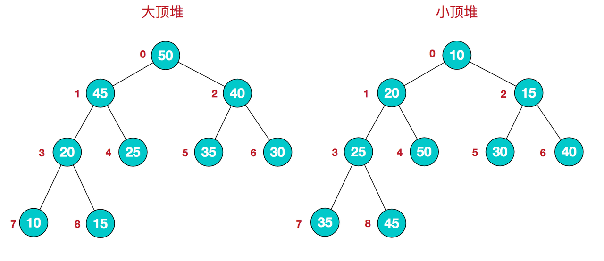

<!-- START doctoc generated TOC please keep comment here to allow auto update -->
<!-- DON'T EDIT THIS SECTION, INSTEAD RE-RUN doctoc TO UPDATE -->
**Table of Contents**  *generated with [DocToc](https://github.com/thlorenz/doctoc)*

- [常见算法及其复杂度](#%E5%B8%B8%E8%A7%81%E7%AE%97%E6%B3%95%E5%8F%8A%E5%85%B6%E5%A4%8D%E6%9D%82%E5%BA%A6)
- [:point_right:冒泡排序（Bubble Sort）](#point_right%E5%86%92%E6%B3%A1%E6%8E%92%E5%BA%8Fbubble-sort)
  - [code-golang](#code-golang)
  - [code-python](#code-python)
- [:point_right:选择排序（Selection Sort）](#point_right%E9%80%89%E6%8B%A9%E6%8E%92%E5%BA%8Fselection-sort)
  - [code-golang](#code-golang-1)
  - [code-python](#code-python-1)
- [插入排序（Insertion Sort）](#%E6%8F%92%E5%85%A5%E6%8E%92%E5%BA%8Finsertion-sort)
  - [code-golang](#code-golang-2)
  - [code-python](#code-python-2)
- [希尔排序（Shell Sort）](#%E5%B8%8C%E5%B0%94%E6%8E%92%E5%BA%8Fshell-sort)
  - [code-golang](#code-golang-3)
  - [code-python](#code-python-3)
- [归并排序（Merge Sort）](#%E5%BD%92%E5%B9%B6%E6%8E%92%E5%BA%8Fmerge-sort)
  - [code-golang](#code-golang-4)
  - [code-python](#code-python-4)
- [:point_right:快速排序（Quick Sort）](#point_right%E5%BF%AB%E9%80%9F%E6%8E%92%E5%BA%8Fquick-sort)
  - [code-golang](#code-golang-5)
  - [code-python](#code-python-5)
- [:point_right:堆排序（Heap Sort）](#point_right%E5%A0%86%E6%8E%92%E5%BA%8Fheap-sort)
  - [code-golang](#code-golang-6)
  - [code-python](#code-python-6)
- [计数排序（Counting Sort）](#%E8%AE%A1%E6%95%B0%E6%8E%92%E5%BA%8Fcounting-sort)
  - [code-golang](#code-golang-7)
  - [code-python](#code-python-7)
- [桶排序（Bucket Sort）](#%E6%A1%B6%E6%8E%92%E5%BA%8Fbucket-sort)
  - [code-golang](#code-golang-8)
  - [code-python](#code-python-8)
- [基数排序（Radix Sort）](#%E5%9F%BA%E6%95%B0%E6%8E%92%E5%BA%8Fradix-sort)
  - [code-golang](#code-golang-9)
  - [code-python](#code-python-9)

<!-- END doctoc generated TOC please keep comment here to allow auto update -->

# 常见算法及其复杂度

| 算法名称                   | 时间复杂度                | 空间复杂度     |
| -------------------------- | ------------------------- | -------------- |
| 冒泡排序（Bubble Sort）    | O(n^2)                    | O(1)           |
| 选择排序（Selection Sort） | O(n^2)                    | O(1)           |
| 插入排序（Insertion Sort） | O(n^2)                    | O(1)           |
| 希尔排序（Shell Sort）     | O(n*logn)~O(n^2)          | O(1)           |
| 归并排序（Merge Sort）     | O(n*logn)                 | O(n)           |
| 快速排序（Quick Sort）     | O(n*logn) ~ O(n^2)        | O(logn) ~ O(n) |
| 堆排序（Heap Sort）        | O(n*logn)                 | O(1)           |
| 计数排序（Counting Sort）  | O(n+k)                    | O(k)           |
| 桶排序（Bucket Sort）      | O(n+k)                    | O(k)           |
| 基数排序（Radix Sort）     | O(d*(n+k))其中d是数字位数 | O(n+k)         |

# :point_right:冒泡排序（Bubble Sort）

冒泡排序（Bubble Sort）是一种简单的排序算法，它的基本思想是重复地遍历要排序的数组，每次比较相邻的两个元素，如果它们的顺序错误就交换它们。通过多次遍历，将最大的元素依次冒泡到数组的最后面，最终完成排序。

冒泡排序的时间复杂度为O(n^2)，空间复杂度为O(1)，是一种稳定的排序算法。

## code-golang

```Go
// BubbleSort 冒泡排序.
func BubbleSort(arr []int) []int {
    l := len(arr)
    for i := 0; i < l; i++ {
        for j := i + 1; j < l; j++ {
            if arr[i] > arr[j] {
                arr[i], arr[j] = arr[j], arr[i]
            }
        }
    }
    return arr
}
```

## code-python

```Python
def bubble_sort(arr:list[int]) -> list[int]:
    """
    bubble_sort 冒泡排序
    """
    for i in range(len(arr)):
        for j in range(i+1,len(arr)):
            if arr[i] > arr[j]:
                arr[i], arr[j] = arr[j], arr[i]

    return arr
```

# :point_right:选择排序（Selection Sort）

选择排序（Selection Sort）是每次从待排序的元素中选出最小（或最大）的一个元素，放在已排好序的元素的末尾，直到所有元素都排好序为止。

选择排序的时间复杂度为 O(n^2)，空间复杂度为 O(1)，是一种较为简单但效率较低的排序算法，适用于小规模数据的排序。

## code-golang

```Go
// SelectionSort 选择排序.
func SelectionSort(arr []int) []int {
    l := len(arr)
    for i := 0; i < l-1; i++ {
        minIndex := i
        for j := i + 1; j < l; j++ {
            if arr[minIndex] > arr[j] {
                minIndex = j
            }
        }
        arr[i], arr[minIndex] = arr[minIndex], arr[i]
    }

    return arr
}
```

## code-python

```Python
def selection_sort(arr: list[int]) -> list[int]:
    """
    selection_sort 选择排序
    """
    for i in range(len(arr)-1):
        min_index = i
        for j in range(i+1, len(arr)):
            if arr[min_index] > arr[j]:
                min_index = j
        arr[i], arr[min_index] = arr[min_index], arr[i]

    return arr
```

# 插入排序（Insertion Sort）

插入排序（Insertion Sort）基本思想是将一个数插入到已经排好序的有序序列中，形成一个新的有序序列。

具体实现步骤如下：

1. 从第一个元素开始，该元素可以认为已经被排序；
2. 取出下一个元素，在已经排序的元素序列中从后向前扫描；
3. 如果已排序的元素大于新元素，将该元素移到下一位置；

插入排序的时间复杂度为 O(n^2)，空间复杂度为 O(1)，在实际应用中，对于小规模或基本有序的数据，插入排序的效率比较高。

## code-golang

```Go
// InsertionSort 插入排序
func InsertionSort(arr []int) []int {
    l := len(arr)
    for i := 1; i < l; i++ {
        preIndex := i - 1
        // 保留一份值
        tmp := arr[i]
        for preIndex >= 0 && arr[preIndex] > tmp {
            // 排序好元素比当前大，往后挪动
            arr[preIndex+1] = arr[preIndex]
            preIndex--
        }
        // 插入到当前位置
        arr[preIndex+1] = tmp
    }

    return arr
}
```

## code-python

```Python
def insertion_sort(arr: list[int]) -> list[int]:
    """
    insertion_sort 插入排序
    """
    for i in range(1,len(arr)):
        pre_index = i - 1
        # 临时值
        tmp:int = arr[i]
        while pre_index >= 0 and arr[pre_index] > tmp:
            # 挪动
            arr[pre_index+1] = arr[pre_index]
            pre_index -= 1
        # c插入到正确位置
        arr[pre_index+1] = tmp

    return arr
```

# 希尔排序（Shell Sort）

希尔排序（Shell Sort）,也称递减增量排序算法，是插入排序的一种更高效的改进版本。但希尔排序是非稳定排序算法。

希尔排序是基于插入排序的以下两点性质而提出改进方法的：

- 插入排序在对几乎已经排好序的数据操作时，效率高，即可以达到线性排序的效率；
- 但插入排序一般来说是低效的，因为插入排序每次只能将数据移动一位；

希尔排序的时间复杂度与增量序列的选择有关，最坏情况下为 O(n^2)，平均情况下为 O(nlogn)，空间复杂度为 O(1)

## code-golang

```Go
// ShellSort 希尔排序
func ShellSort(arr []int) []int {
    l := len(arr)
    // 设置gap
    gap := 1
    for gap < l/3 {
        gap = gap*3 + 1
    }
    for gap > 0 {
        for i := gap; i < l; i++ {
            tmp := arr[i]
            // 临时索引
            j := i - gap
            for j >= 0 && arr[j] > tmp {
                arr[j+gap] = arr[j]
                j -= gap
            }
            arr[j+gap] = tmp
        }
        gap = gap / 3
    }
    return arr
}
```

## code-python

```Python
def shell_sort(arr: list[int]) -> list[int]:
    """
    shell_sort 希尔排序
    """
    gap: int = 1
    while gap < len(arr)//3:
        gap = 3*gap + 1
    while gap > 0:
        for i in range(gap, len(arr)):
            tmp = arr[i]
            # 临时索引
            j = i - gap
            while j >= 0 and arr[j] > tmp:
                arr[j+gap] = arr[j]
                j -= gap
            arr[j+gap] = tmp
        gap = gap//3
        
    return arr
```

# 归并排序（Merge Sort）

归并排序（Merge Sort）是一种基于分治思想的排序算法，将待排序的数组分成若干个子序列，将每个子序列排序后再将子序列合并成一个有序序列，直到最终排序完成

具体实现步骤如下：

1. 将待排序的数组不断二分，直到每个子序列只有一个元素为止；
2. 对每个子序列进行排序，可以使用插入排序、选择排序等简单排序算法；
3. 将相邻的子序列两两合并，合并时比较两个子序列的第一个元素，将较小的元素先放入临时数组中，直到其中一个子序列为空，再将另一个子序列中剩余的元素依次放入临时数组中；
4. 重复步骤 3，直到所有的子序列都合并成一个有序序列；

归并排序的时间复杂度为 O(nlogn)，空间复杂度为 O(n)，是一种稳定的排序算法，适用于各种数据规模的排序，但是在实现上需要使用额外的空间，因此不适用于内存有限的场景。

## code-golang

```Go
// MergerSort 归并排序.
func MergerSort(arr []int) []int {
    l := len(arr)
    if l < 2 {
        return arr
    }
    mid := l / 2
    left := MergerSort(arr[:mid])
    right := MergerSort(arr[mid:])
    return meger(left, right)
}

// meger 归并排序处理函数.
func meger(left, right []int) []int {
    res := make([]int, 0)
    for len(left) > 0 && len(right) > 0 {
        if left[0] > right[0] {
            res = append(res, right[0])
            right = right[1:]
        } else {
            res = append(res, left[0])
            left = left[1:]
        }
    }
    if len(left) == 0 {
        res = append(res, right...)
    }
    if len(right) == 0 {
        res = append(res, left...)
    }
    return res
}
```

## code-python

```Python
def merge_sort(arr: list[int]) -> list[int]:
    """
    merge_sort 归并排序
    """
    l = len(arr)
    if l < 2:
        return arr
    mid = l // 2
    left = merge_sort(arr[:mid])
    right = merge_sort(arr[mid:])
    return meger(left, right)

def meger(left: list[int], right: list[int]) -> list[int]:
    """
    meger 归并函数处理函数
    """
    res = []
    while len(left) > 0 and len(right) > 0:
        if left[0] > right[0]:
            res.append(right[0])
            right.pop(0)
        else:
            res.append(left[0])
            left.pop(0)

    if len(left) == 0:
        res += right
    if len(right) == 0:
        res += left

    return res
```

# :point_right:快速排序（Quick Sort）

快速排序（Quick Sort）是一种基于分治思想的排序算法，通过对待排序的数组进行分区（Partition），将大于分区值的元素放到分区值的右侧，将小于分区值的元素放到分区值的左侧，然后对左右两个子序列递归地进行同样的分区操作，直到最终排序完成。

具体实现步骤如下：

1. 从数列中挑出一个元素，称为 "基准"（pivot）;
2. 重新排序数列，所有元素比基准值小的摆放在基准前面，所有元素比基准值大的摆在基准的后面（相同的数可以到任一边）。在这个分区退出之后，该基准就处于数列的中间位置。这个称为分区（partition）操作；
3. 递归地（recursive）把小于基准值元素的子数列和大于基准值元素的子数列排序；

快速排序时间复杂度为O(n*logn) ~ O(n^2),空间复杂度O(logn) ~ O(n)具体实现中，可以使用双指针法或三数取中法来选择基准元素，以避免出现最坏情况的时间复杂度。

## code-golang

```Go
// QuickSort 快速排序
// 排序QuickSort n 个项目要 Ο(nlogn) 次比较。在最坏状况下则需要 Ο(n2) 次比较，但这种状况并不常见。事实上，快速排序通常明显比其他 Ο(nlogn) 算法更快
func QuickSort(arr []int, left int, right int) []int {
    if left >= right {
        return arr
    }
    q := partition(arr, left, right)
    QuickSort(arr, left, q-1)
    QuickSort(arr, q+1, right)
    return arr
}

// partition 定位函数
func partition(arr []int, left int, right int) int {
    // 以当前数据序列最后一个元素作为初始 pivot
    pivot := arr[right]
    i := left
    for j := left; j < right; j++ {
        if arr[j] < pivot {
            arr[i], arr[j] = arr[j], arr[i]
            i++
        }
    }

    arr[i], arr[right] = pivot, arr[i]
    return i
}
// QuickSort(arr, 0, len(arr)-1)
```

## code-python

```Python
def quick_sort(arr: list[int], left: int, right: int) -> list[int]:
    """
    quick_sort 快速排序
    排序QuickSort n 个项目要 Ο(nlogn) 次比较。在最坏状况下则需要 Ο(n2) 次比较，但这种状况并不常见。事实上，快速排序通常明显比其他 Ο(nlogn) 算法更快
    """
    if left >= right:
        return arr

    q = partition(arr, left, right)
    quick_sort(arr, left, q-1)
    quick_sort(arr, q+1, right)
    return arr

def partition(arr: list[int], left: int, right: int) -> int:
    # 以当前数据序列最后一个元素作为初始 pivot
    pivot = arr[right]
    i = left

    for j in range(left, right):
        if arr[j] < pivot:
            arr[i], arr[j] = arr[j], arr[i]
            i += 1
    arr[i], arr[right] = pivot, arr[i]
    return i
  
  # quick_sort(arr, 0, len(arr)-1)
```

# :point_right:堆排序（Heap Sort）

堆排序（Heap Sort）是一种比较高效的排序算法，它的基本思想是将待排序的序列构建成一个堆，然后依次取出堆顶元素，将其放到有序序列的末尾。由于堆可以快速找到最大或最小元素，所以堆排序的时间复杂度为 O(nlogn)。

堆积是一个近似完全二叉树的结构，并同时满足堆积的性质：即子结点的键值或索引总是小于（或者大于）它的父节点。堆排序可以说是一种利用堆的概念来排序的选择排序。分为两种方法：

1. 大顶堆：每个节点的值都大于或等于其子节点的值，在堆排序算法中用于升序排列；
2. 小顶堆：每个节点的值都小于或等于其子节点的值，在堆排序算法中用于降序排列；



堆排序的具体实现步骤如下：

1. 将待排序序列构建成一个大根堆或小根堆；
2. 依次取出堆顶元素，将其放到有序序列的末尾；
3. 重新构建堆。

## code-golang

```Go
// HeapSort 堆排序
func HeapSort(arr []int) {
    n := len(arr)

    // 构建最大堆
    for i := n/2 - 1; i >= 0; i-- {
        heapify(arr, n, i)
    }

    // 从最后一个元素开始，依次将其与根节点交换并调整堆
    for i := n - 1; i >= 0; i-- {
        arr[0], arr[i] = arr[i], arr[0]
        heapify(arr, i, 0)
    }
}

// heapify 将以i为根节点的子树调整为最大堆
func heapify(arr []int, n, i int) {
    largest := i // largest记录最大值的下标
    left, right := 2*i+1, 2*i+2

    if left < n && arr[left] > arr[largest] {
        largest = left
    }
    if right < n && arr[right] > arr[largest] {
        largest = right
    }

    if largest != i {
        arr[i], arr[largest] = arr[largest], arr[i]
        heapify(arr, n, largest)
    }
}
```

## code-python

```Python
def heap_sort(arr: list[int]):
    """
    heap_sort 堆排序
    """
    n = len(arr)

    # 构建最大堆
    for i in reversed(range(n//2)):
        heapify(arr, n, i)

    # 从最后一个元素开始，依次将其与根节点交换并调整堆
    for i in reversed(range(n)):
        arr[0], arr[i] = arr[i], arr[0]
        heapify(arr, i, 0)

def heapify(arr: list[int], n: int, i: int):
    """
    heapify 将以i为根节点的子树调整为最大堆
    """
    largest = i
    left, right = 2*i+1, 2*i+2

    if left < n and arr[left] > arr[largest]:
        largest = left

    if right < n and arr[right] > arr[largest]:
        largest = right

    if largest != i:
        arr[i], arr[largest] = arr[largest], arr[i]
        heapify(arr, n, largest)
```

# 计数排序（Counting Sort）

计数排序（Counting Sort）是一种非比较排序算法，它的核心思想是统计每个元素在序列中出现的次数，然后根据元素出现的次数，对序列中的元素进行排序。计数排序适用于元素范围比较小的序列，时间复杂度为O(n+k)，其中k是元素的范围。

计数排序的具体实现流程如下：

1. 找到序列中的最大值和最小值，计算出元素的范围。
2. 创建一个计数数组count，用于统计每个元素在序列中出现的次数。对于序列中的每个元素，都将其出现次数加1。
3. 计算每个元素在排序后的序列中的位置。由于元素的范围比较小，我们可以直接使用计数数组count来计算每个元素在排序后的序列中的位置。我们从左到右遍历计数数组count，对于每个元素count[i]，将其加上前面所有元素出现的次数，得到元素在排序后的序列中的位置。
4. 将元素放入排序后的序列中。由于有可能有相同的元素，我们需要从序列的末尾开始遍历，将元素放入排序后的序列中，同时将计数数组count中对应元素的值减1。
5. 将排序后的序列赋值给原序列。

## code-golang

```Go
func CountingSort(arr []int) {
    n := len(arr)
    if n <= 1 {
        return
    }

    // 找到序列中的最大值和最小值
    max, min := arr[0], arr[0]
    for i := 1; i < n; i++ {
        if arr[i] > max {
            max = arr[i]
        }
        if arr[i] < min {
            min = arr[i]
        }
    }

    // 统计每个元素在序列中出现的次数
    count := make([]int, max-min+1)
    for i := 0; i < n; i++ {
        count[arr[i]-min]++
    }

    // 计算每个元素在排序后的序列中的位置
    for i := 1; i < len(count); i++ {
        count[i] += count[i-1]
    }

    // 将元素放入排序后的序列中
    sorted := make([]int, n)
    for i := n - 1; i >= 0; i-- {
        index := count[arr[i]-min] - 1
        sorted[index] = arr[i]
        count[arr[i]-min]--
    }

    // 将排序后的序列赋值给原序列
    for i := 0; i < n; i++ {
        arr[i] = sorted[i]
    }
}
```

## code-python

```Python
def counting_sort(arr:list[int]) -> None:
    """
    counting_sort 计数排序
    """
    if len(arr) < 2 :
        return

    # 找到最大值和最小值
    max,min = arr[0],arr[0]
    for i in range(1,len(arr)):
        if arr[i] > max:
            max = arr[i]
        
        if arr[i] < min :
            min = arr[i]

    count = [0]*(max-min+1)
   
    for i in range(len(arr)):
        count[arr[i]-min]+=1
    
    for i in range(1,len(count)):
        count[i] += count[i-1]

    # 将元素放入排序后的序列中
    sorted = [0] * len(arr)
    for i in reversed(range(len(arr))):
        index = count[arr[i]-min] -1
        sorted[index] = arr[i]
        count[arr[i]-min]-=1
    
    #return sorted
    for i in range(len(arr)):
        arr[i] = sorted[i]
```

# 桶排序（Bucket Sort）

桶排序（Bucket Sort）是一种非比较排序算法，它将要排序的数据分到有限数量的桶子里，每个桶子再分别排序（可以使用别的排序算法或是以递归方式继续使用桶排序进行排序）。桶排序的核心思想是将数据划分到不同的桶中，然后对每个桶中的数据进行排序，最后将所有桶中的数据依次取出，就得到了排序后的序列。

桶排序的具体实现流程如下：

1. 找到序列中的最大值和最小值，计算出元素的范围。
2. 创建桶，将元素分配到不同的桶中。
3. 对每个桶中的元素进行排序（可以使用别的排序算法或是以递归方式继续使用桶排序进行排序）。
4. 将所有桶中的元素依次取出，组成排序后的序列。

## code-golang

```Python
func bucketSort(arr []int) []int {
    n := len(arr)
    if n <= 1 {
        return arr
    }

    // 找到序列中的最大值和最小值，计算出元素的范围
    max, min := arr[0], arr[0]
    for i := 1; i < n; i++ {
        if arr[i] > max {
            max = arr[i]
        }
        if arr[i] < min {
            min = arr[i]
        }
    }

    // 创建桶，将元素分配到不同的桶中
    bucketSize := 10
    bucketCount := (max-min)/bucketSize + 1
    buckets := make([][]int, bucketCount)
    for i := 0; i < bucketCount; i++ {
        buckets[i] = make([]int, 0)
    }
    for i := 0; i < n; i++ {
        index := (arr[i] - min) / bucketSize
        buckets[index] = append(buckets[index], arr[i])
    }

    // 对每个桶中的元素进行排序（可以使用别的排序算法或是以递归方式继续使用桶排序进行排序）
    for i := 0; i < bucketCount; i++ {
        bucket := buckets[i]
        if len(bucket) > 0 {
            // 这里使用插入排序对每个桶中的元素进行排序，也可以使用别的排序算法
            for j := 1; j < len(bucket); j++ {
                key := bucket[j]
                k := j - 1
                for k >= 0 && bucket[k] > key {
                    bucket[k+1] = bucket[k]
                    k--
                }
                bucket[k+1] = key
            }
        }
    }

    // 将所有桶中的元素依次取出，组成排序后的序列
    sorted := make([]int, n)
    index := 0
    for i := 0; i < bucketCount; i++ {
        bucket := buckets[i]
        for j := 0; j < len(bucket); j++ {
            sorted[index] = bucket[j]
            index++
        }
    }

    return sorted
}
```

## code-python

```Python
def bucket_sort(arr):
    n = len(arr)
    if n <= 1:
        return arr

    # 找到序列中的最大值和最小值，计算出元素的范围
    max, min = arr[0], arr[0]
    for i in range(1, n):
        if arr[i] > max:
            max = arr[i]
        if arr[i] < min:
            min = arr[i]

    # 创建桶，将元素分配到不同的桶中
    bucket_size = 10
    bucket_count = (max - min) // bucket_size + 1
    buckets = [[] for _ in range(bucket_count)]
    for i in range(n):
        index = (arr[i] - min) // bucket_size
        buckets[index].append(arr[i])

    # 对每个桶中的元素进行排序（可以使用别的排序算法或是以递归方式继续使用桶排序进行排序）
    for i in range(bucket_count):
        buckets[i].sort()

    # 将所有桶中的元素依次取出，组成排序后的序列
    sorted = []
    for i in range(bucket_count):
        sorted += buckets[i]

    return sorted
```

# 基数排序（Radix Sort）

基数排序（Radix Sort）是一种非比较排序算法，它根据数字的每一位上的数字来排序。基数排序的时间复杂度为O(d(n+k))，其中d是数字的最大位数，n是序列的长度，k是每个数字可能的取值范围。

基数排序有两种方法：

这三种排序算法都利用了桶的概念，但对桶的使用方法上有明显差异：

- 基数排序：根据键值的每位数字来分配桶；
- 计数排序：每个桶只存储单一键值；
- 桶排序：每个桶存储一定范围的数值；

## code-golang

```Go
func radixSort(arr []int) []int {
    n := len(arr)
    if n <= 1 {
        return arr
    }

    // 找出最大值
    max := arr[0]
    for i := 1; i < n; i++ {
        if arr[i] > max {
            max = arr[i]
        }
    }

    // 计算最大位数
    digit := 0
    for max != 0 {
        digit++
        max /= 10
    }

    // 按位数排序
    for i := 0; i < digit; i++ {
        buckets := make([][]int, 10)
        for j := 0; j < 10; j++ {
            buckets[j] = make([]int, 0)
        }

        // 将数字放入桶中
        for j := 0; j < n; j++ {
            index := arr[j] / int(math.Pow(10, float64(i))) % 10
            buckets[index] = append(buckets[index], arr[j])
        }

        // 将桶中的数字按顺序取出来
        index := 0
        for j := 0; j < 10; j++ {
            bucket := buckets[j]
            for k := 0; k < len(bucket); k++ {
                arr[index] = bucket[k]
                index++
            }
        }
    }

    return arr
}
```

## code-python

```Python
def radix_sort(arr):
    n = len(arr)
    if n <= 1:
        return arr

    # 找出最大值
    max_num = max(arr)

    # 计算最大位数
    digit = 0
    while max_num != 0:
        digit += 1
        max_num //= 10

    # 按位数排序
    for i in range(digit):
        buckets = [[] for _ in range(10)]

        # 将数字放入桶中
        for j in range(n):
            index = arr[j] // 10 ** i % 10
            buckets[index].append(arr[j])

        # 将桶中的数字按顺序取出来
        index = 0
        for j in range(10):
            bucket = buckets[j]
            for k in range(len(bucket)):
                arr[index] = bucket[k]
                index += 1

    return arr
```