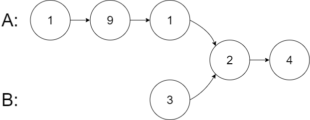

<!-- START doctoc generated TOC please keep comment here to allow auto update -->
<!-- DON'T EDIT THIS SECTION, INSTEAD RE-RUN doctoc TO UPDATE -->
**Table of Contents**  *generated with [DocToc](https://github.com/thlorenz/doctoc)*

- [简介](#%E7%AE%80%E4%BB%8B)
- [203. 移除链表元素](#203-%E7%A7%BB%E9%99%A4%E9%93%BE%E8%A1%A8%E5%85%83%E7%B4%A0)
  - [code-golang](#code-golang)
  - [code-python](#code-python)
- [707. 设计链表](#707-%E8%AE%BE%E8%AE%A1%E9%93%BE%E8%A1%A8)
  - [code-golang](#code-golang-1)
  - [code-python](#code-python-1)
- [206. 反转链表](#206-%E5%8F%8D%E8%BD%AC%E9%93%BE%E8%A1%A8)
  - [code-golang](#code-golang-2)
  - [code-python](#code-python-2)
- [24. 两两交换链表中的节点](#24-%E4%B8%A4%E4%B8%A4%E4%BA%A4%E6%8D%A2%E9%93%BE%E8%A1%A8%E4%B8%AD%E7%9A%84%E8%8A%82%E7%82%B9)
  - [code-golang](#code-golang-3)
  - [code-python](#code-python-3)
- [19. 删除链表的倒数第 N 个结点](#19-%E5%88%A0%E9%99%A4%E9%93%BE%E8%A1%A8%E7%9A%84%E5%80%92%E6%95%B0%E7%AC%AC-n-%E4%B8%AA%E7%BB%93%E7%82%B9)
  - [code-golang](#code-golang-4)
  - [code-python](#code-python-4)
- [160. 相交链表](#160-%E7%9B%B8%E4%BA%A4%E9%93%BE%E8%A1%A8)
  - [code-golang](#code-golang-5)
  - [code-python](#code-python-5)
- [142. 环形链表 II](#142-%E7%8E%AF%E5%BD%A2%E9%93%BE%E8%A1%A8-ii)
  - [code-golang](#code-golang-6)
  - [code-python](#code-python-6)
- [temp](#temp)
  - [code-golang](#code-golang-7)
  - [code-python](#code-python-7)
- [temp](#temp-1)
  - [code-golang](#code-golang-8)
  - [code-python](#code-python-8)

<!-- END doctoc generated TOC please keep comment here to allow auto update -->

# 简介

链表（Linked List）是最简单的线性的、动态数据结构。理解它是理解树结构、图结构的基础。

链表区别于数组，链表中的元素不是存储在内存中连续的一片区域，链表中的数据存储在每一个称之为「结点」复合区域里，在每一个结点除了存储数据以外，还保存了到下一个节点的指针（Pointer）。

链表有很多种不同的类型：单向链表，双向链表以及循环链表。

# [203. 移除链表元素](https://leetcode.cn/problems/remove-linked-list-elements/)

给你一个链表的头节点 `head` 和一个整数 `val` ，请你删除链表中所有满足 `Node.val == val` 的节点，并返回 **新的头节点** 。

**示例 1：**


```
输入：head = [1,2,6,3,4,5,6], val = 6
输出：[1,2,3,4,5]
```

**示例 2：**

```
输入：head = [], val = 1
输出：[]
```

**示例 3：**

```
输入：head = [7,7,7,7], val = 7
输出：[]
```

**提示：**

- 列表中的节点数目在范围 `[0, 104]` 内
- `1 <= Node.val <= 50`
- `0 <= val <= 50`

## code-golang

方法一：迭代

```go
/**
 * Definition for singly-linked list.
 * type ListNode struct {
 *     Val int
 *     Next *ListNode
 * }
 */
func removeElements(head *ListNode, val int) *ListNode {
	// 处理头节点等于 val 的情况
	for head != nil && head.Val == val {
		head = head.Next
	}

	curr := head

	for curr != nil && curr.Next != nil {
		if curr.Next.Val == val {
			curr.Next = curr.Next.Next
		} else {
			curr = curr.Next
		}
	}

	return head
}
```

## code-python

方法一：迭代

```python
# Definition for singly-linked list.
# class ListNode:
#     def __init__(self, val=0, next=None):
#         self.val = val
#         self.next = next
class Solution:
    def removeElements(self, head: Optional[ListNode], val: int) -> Optional[ListNode]:
        # 处理头节点等于 val 的情况
        while head and head.val == val:
            head = head.next

        curr:Optional[ListNode] = head
        while curr and curr.next:
            if curr.next.val == val:
                curr.next = curr.next.next
            else:
                curr = curr.next
        
        return head
```

# [707. 设计链表](https://leetcode.cn/problems/design-linked-list/)

你可以选择使用单链表或者双链表，设计并实现自己的链表。

单链表中的节点应该具备两个属性：`val` 和 `next` 。`val` 是当前节点的值，`next` 是指向下一个节点的指针/引用。

如果是双向链表，则还需要属性 `prev` 以指示链表中的上一个节点。假设链表中的所有节点下标从 **0** 开始。

实现 `MyLinkedList` 类：

- `MyLinkedList()` 初始化 `MyLinkedList` 对象。
- `int get(int index)` 获取链表中下标为 `index` 的节点的值。如果下标无效，则返回 `-1` 。
- `void addAtHead(int val)` 将一个值为 `val` 的节点插入到链表中第一个元素之前。在插入完成后，新节点会成为链表的第一个节点。
- `void addAtTail(int val)` 将一个值为 `val` 的节点追加到链表中作为链表的最后一个元素。
- `void addAtIndex(int index, int val)` 将一个值为 `val` 的节点插入到链表中下标为 `index` 的节点之前。如果 `index` 等于链表的长度，那么该节点会被追加到链表的末尾。如果 `index` 比长度更大，该节点将 **不会插入** 到链表中。
- `void deleteAtIndex(int index)` 如果下标有效，则删除链表中下标为 `index` 的节点。

**示例：**

```
输入
["MyLinkedList", "addAtHead", "addAtTail", "addAtIndex", "get", "deleteAtIndex", "get"]
[[], [1], [3], [1, 2], [1], [1], [1]]
输出
[null, null, null, null, 2, null, 3]

解释
MyLinkedList myLinkedList = new MyLinkedList();
myLinkedList.addAtHead(1);
myLinkedList.addAtTail(3);
myLinkedList.addAtIndex(1, 2);    // 链表变为 1->2->3
myLinkedList.get(1);              // 返回 2
myLinkedList.deleteAtIndex(1);    // 现在，链表变为 1->3
myLinkedList.get(1);              // 返回 3
```

**提示：**

- `0 <= index, val <= 1000`
- 请不要使用内置的 LinkedList 库。
- 调用 `get`、`addAtHead`、`addAtTail`、`addAtIndex` 和 `deleteAtIndex` 的次数不超过 `2000` 。

## code-golang

```go
type MyLinkedList struct {
	head *Node
	size int
}

type Node struct {
	val  int
	next *Node
}

/** Initialize your data structure here. */
func Constructor() MyLinkedList {
	return MyLinkedList{}
}

/** Get the value of the index-th node in the linked list. If the index is invalid, return -1. */
func (list *MyLinkedList) Get(index int) int {
	if index < 0 || index >= list.size {
		return -1
	}

	curr := list.head
	for i := 0; i < index; i++ {
		curr = curr.next
	}

	return curr.val
}

/** Add a node of value val before the first element of the linked list. After the insertion, the new node will be the first node of the linked list. */
func (list *MyLinkedList) AddAtHead(val int) {
	newNode := &Node{val: val, next: list.head}
	list.head = newNode
	list.size++
}

/** Append a node of value val to the last element of the linked list. */
func (list *MyLinkedList) AddAtTail(val int) {
	newNode := &Node{val: val}
	if list.head == nil {
		list.head = newNode
	} else {
		curr := list.head
		for curr.next != nil {
			curr = curr.next
		}
		curr.next = newNode
	}
	list.size++
}

/** Add a node of value val before the index-th node in the linked list. If index equals to the length of linked list, the node will be appended to the end of linked list. If index is greater than the length, the node will not be inserted. */
func (list *MyLinkedList) AddAtIndex(index int, val int) {
	if index < 0 || index > list.size {
		return
	}

	if index == 0 {
		list.AddAtHead(val)
		return
	}

	if index == list.size {
		list.AddAtTail(val)
		return
	}

	curr := list.head
	for i := 0; i < index-1; i++ {
		curr = curr.next
	}

	newNode := &Node{val: val, next: curr.next}
	curr.next = newNode
	list.size++
}

/** Delete the index-th node in the linked list, if the index is valid. */
func (list *MyLinkedList) DeleteAtIndex(index int) {
	if index < 0 || index >= list.size {
		return
	}

	if index == 0 {
		list.head = list.head.next
		list.size--
		return
	}

	curr := list.head
	for i := 0; i < index-1; i++ {
		curr = curr.next
	}

	curr.next = curr.next.next
	list.size--
}

/**
 * Your MyLinkedList object will be instantiated and called as such:
 * obj := Constructor();
 * param_1 := obj.Get(index);
 * obj.AddAtHead(val);
 * obj.AddAtTail(val);
 * obj.AddAtIndex(index,val);
 * obj.DeleteAtIndex(index);
 */
```

## code-python

```python
class ListNode:
    def __init__(self, val=0, next=None):
        self.val = val
        self.next = next

class MyLinkedList:
    def __init__(self):
        self.head = None
        self.size = 0

    def get(self, index: int) -> int:
        if index < 0 or index >= self.size:
            return -1
        
        curr = self.head
        for _ in range(index):
            curr = curr.next
        
        return curr.val

    def addAtHead(self, val: int) -> None:
        newNode = ListNode(val)
        newNode.next = self.head
        self.head = newNode
        self.size += 1

    def addAtTail(self, val: int) -> None:
        newNode = ListNode(val)
        if not self.head:
            self.head = newNode
        else:
            curr = self.head
            while curr.next:
                curr = curr.next
            curr.next = newNode
        self.size += 1

    def addAtIndex(self, index: int, val: int) -> None:
        if index < 0 or index > self.size:
            return
        
        if index == 0:
            self.addAtHead(val)
            return
        
        newNode = ListNode(val)
        curr = self.head
        for _ in range(index - 1):
            curr = curr.next
        newNode.next = curr.next
        curr.next = newNode
        self.size += 1

    def deleteAtIndex(self, index: int) -> None:
        if index < 0 or index >= self.size:
            return
        
        if index == 0:
            self.head = self.head.next
            self.size -= 1
            return
        
        curr = self.head
        for _ in range(index - 1):
            curr = curr.next
        curr.next = curr.next.next
        self.size -= 1

# Your MyLinkedList object will be instantiated and called as such:
# obj = MyLinkedList()
# param_1 = obj.get(index)
# obj.addAtHead(val)
# obj.addAtTail(val)
# obj.addAtIndex(index,val)
# obj.deleteAtIndex(index)
```

# [206. 反转链表](https://leetcode.cn/problems/reverse-linked-list/)

给你单链表的头节点 `head` ，请你反转链表，并返回反转后的链表。

**示例 1：**


```
输入：head = [1,2,3,4,5]
输出：[5,4,3,2,1]
```

**示例 2：**


```
输入：head = [1,2]
输出：[2,1]
```

**示例 3：**

```
输入：head = []
输出：[]
```

**提示：**

- 链表中节点的数目范围是 `[0, 5000]`
- `-5000 <= Node.val <= 5000`

**进阶：**链表可以选用迭代或递归方式完成反转。你能否用两种方法解决这道题？

## code-golang

方法一：迭代

```go
/**
 * Definition for singly-linked list.
 * type ListNode struct {
 *     Val int
 *     Next *ListNode
 * }
 */
func reverseList(head *ListNode) *ListNode {
	var prev *ListNode
	curr := head
    
	for curr != nil {
		next := curr.Next
		curr.Next = prev
		prev = curr
		curr = next
	}
    
	return prev
}
```

方法二：递归

```go
/**
 * Definition for singly-linked list.
 * type ListNode struct {
 *     Val int
 *     Next *ListNode
 * }
 */
func reverseList(head *ListNode) *ListNode {
	for head == nil || head.Next == nil {
		return head
	}

	newHead := reverseList(head.Next)
	head.Next.Next = head
	head.Next = nil
    
	return newHead
}
```

## code-python

方法一：迭代

```python
# Definition for singly-linked list.
# class ListNode:
#     def __init__(self, val=0, next=None):
#         self.val = val
#         self.next = next
class Solution:
    def reverseList(self, head: ListNode) -> ListNode:
        prev, curr = None, head
        
        while curr:
            next_node = curr.next
            curr.next = prev
            prev = curr
            curr = next_node

        return prev
```

方法二：递归

```python
# Definition for singly-linked list.
# class ListNode:
#     def __init__(self, val=0, next=None):
#         self.val = val
#         self.next = next
class Solution:
    def reverseList(self, head: ListNode) -> ListNode:
        if not head or not head.next:
            return head

        new_head = self.reverseList(head.next)
        head.next.next = head
        head.next = None
        
        return new_head
```

# [24. 两两交换链表中的节点](https://leetcode.cn/problems/swap-nodes-in-pairs/)

给你一个链表，两两交换其中相邻的节点，并返回交换后链表的头节点。你必须在不修改节点内部的值的情况下完成本题（即，只能进行节点交换）。

**示例 1：**


```
输入：head = [1,2,3,4]
输出：[2,1,4,3]
```

**示例 2：**

```
输入：head = []
输出：[]
```

**示例 3：**

```
输入：head = [1]
输出：[1]
```

**提示：**

- 链表中节点的数目在范围 `[0, 100]` 内
- `0 <= Node.val <= 100`

## code-golang

方法一：

```go
/**
 * Definition for singly-linked list.
 * type ListNode struct {
 *     Val int
 *     Next *ListNode
 * }
 */
func swapPairs(head *ListNode) *ListNode {
	if head == nil || head.Next == nil {
		return head
	}

	newHead := head.Next
	head.Next = swapPairs(newHead.Next)
	newHead.Next = head
	
	return newHead
}
```

## code-python

方法一：

```python
# Definition for singly-linked list.
# class ListNode:
#     def __init__(self, val=0, next=None):
#         self.val = val
#         self.next = next
class Solution:
    def swapPairs(self, head: ListNode) -> ListNode:
        if not head or not head.next:
            return head

        new_head = head.next
        head.next = self.swapPairs(new_head.next)
        new_head.next = head
        
        return  new_head
```

# [19. 删除链表的倒数第 N 个结点](https://leetcode.cn/problems/remove-nth-node-from-end-of-list/)

给你一个链表，删除链表的倒数第 `n` 个结点，并且返回链表的头结点。

**示例 1：**


```
输入：head = [1,2,3,4,5], n = 2
输出：[1,2,3,5]
```

**示例 2：**

```
输入：head = [1], n = 1
输出：[]
```

**示例 3：**

```
输入：head = [1,2], n = 1
输出：[1]
```

**提示：**

- 链表中结点的数目为 `sz`
- `1 <= sz <= 30`
- `0 <= Node.val <= 100`
- `1 <= n <= sz`

**进阶：**你能尝试使用一趟扫描实现吗？

## code-golang

方法一：双指针

```go
/**
 * Definition for singly-linked list.
 * type ListNode struct {
 *     Val int
 *     Next *ListNode
 * }
 */

// 双指针，fast在slow前面n个
func removeNthFromEnd(head *ListNode, n int) *ListNode {
	slow, fast := head, head
	for i := 0; i < n; i++ {
		fast = fast.Next
	}
    
	if fast == nil {
		return slow.Next
	}
    
	for fast.Next != nil {
		slow = slow.Next
		fast = fast.Next
	}
    
	slow.Next = slow.Next.Next
	return head
}
```

## code-python

方法一：双指针

```python
# Definition for singly-linked list.
# class ListNode:
#     def __init__(self, val=0, next=None):
#         self.val = val
#         self.next = next
class Solution:
    def removeNthFromEnd(self, head: ListNode, n: int) -> ListNode:
        slow, fast = head, head

        for i in range(n):
            fast = fast.next

        if not fast:
            return slow.next

        while fast.next:
            slow = slow.next
            fast = fast.next

        slow.next = slow.next.next

        return head
```

# [160. 相交链表](https://leetcode.cn/problems/intersection-of-two-linked-lists/)

给你两个单链表的头节点 `headA` 和 `headB` ，请你找出并返回两个单链表相交的起始节点。如果两个链表不存在相交节点，返回 `null` 。

图示两个链表在节点 `c1` 开始相交**：**


题目数据 **保证** 整个链式结构中不存在环。

**注意**，函数返回结果后，链表必须 **保持其原始结构** 。

**自定义评测：**

**评测系统** 的输入如下（你设计的程序 **不适用** 此输入）：

- `intersectVal` - 相交的起始节点的值。如果不存在相交节点，这一值为 `0`
- `listA` - 第一个链表
- `listB` - 第二个链表
- `skipA` - 在 `listA` 中（从头节点开始）跳到交叉节点的节点数
- `skipB` - 在 `listB` 中（从头节点开始）跳到交叉节点的节点数

评测系统将根据这些输入创建链式数据结构，并将两个头节点 `headA` 和 `headB` 传递给你的程序。如果程序能够正确返回相交节点，那么你的解决方案将被 **视作正确答案** 。

**示例 1：**


```
输入：intersectVal = 8, listA = [4,1,8,4,5], listB = [5,6,1,8,4,5], skipA = 2, skipB = 3
输出：Intersected at '8'
解释：相交节点的值为 8 （注意，如果两个链表相交则不能为 0）。
从各自的表头开始算起，链表 A 为 [4,1,8,4,5]，链表 B 为 [5,6,1,8,4,5]。
在 A 中，相交节点前有 2 个节点；在 B 中，相交节点前有 3 个节点。
— 请注意相交节点的值不为 1，因为在链表 A 和链表 B 之中值为 1 的节点 (A 中第二个节点和 B 中第三个节点) 是不同的节点。换句话说，它们在内存中指向两个不同的位置，而链表 A 和链表 B 中值为 8 的节点 (A 中第三个节点，B 中第四个节点) 在内存中指向相同的位置。
```

 

**示例 2：**



```
输入：intersectVal = 2, listA = [1,9,1,2,4], listB = [3,2,4], skipA = 3, skipB = 1
输出：Intersected at '2'
解释：相交节点的值为 2 （注意，如果两个链表相交则不能为 0）。
从各自的表头开始算起，链表 A 为 [1,9,1,2,4]，链表 B 为 [3,2,4]。
在 A 中，相交节点前有 3 个节点；在 B 中，相交节点前有 1 个节点。
```

**示例 3：**


```
输入：intersectVal = 0, listA = [2,6,4], listB = [1,5], skipA = 3, skipB = 2
输出：null
解释：从各自的表头开始算起，链表 A 为 [2,6,4]，链表 B 为 [1,5]。
由于这两个链表不相交，所以 intersectVal 必须为 0，而 skipA 和 skipB 可以是任意值。
这两个链表不相交，因此返回 null 。
```

**提示：**

- `listA` 中节点数目为 `m`
- `listB` 中节点数目为 `n`
- `1 <= m, n <= 3 * 104`
- `1 <= Node.val <= 105`
- `0 <= skipA <= m`
- `0 <= skipB <= n`
- 如果 `listA` 和 `listB` 没有交点，`intersectVal` 为 `0`
- 如果 `listA` 和 `listB` 有交点，`intersectVal == listA[skipA] == listB[skipB]`

**进阶：**你能否设计一个时间复杂度 `O(m + n)` 、仅用 `O(1)` 内存的解决方案？

## code-golang

方法一：双指针

```go
/**
 * Definition for singly-linked list.
 * type ListNode struct {
 *     Val int
 *     Next *ListNode
 * }
 */
func getIntersectionNode(headA, headB *ListNode) *ListNode {
	if headA == nil || headB == nil {
		return nil
	}

	left, right := headA, headB
	for left != right {
		if left == nil {
			left = headB
		} else {
			left = left.Next
		}
		
		if right == nil {
			right = headA
		} else {
			right = right.Next
		}
	}
	
	return right
}
```

## code-python

方法一：双指针

```python
# Definition for singly-linked list.
# class ListNode:
#     def __init__(self, x):
#         self.val = x
#         self.next = None


class Solution:
    def getIntersectionNode(self, headA: ListNode, headB: ListNode) -> ListNode:
        if not headA or not headB:
            return None
        
        self.left = headA
        self.right = headB

        while self.left != self.right:
            if not self.left:
                self.left = headB
            else:
                self.left = self.left.next

            if not self.right:
                self.right = headA
            else:
                self.right = self.right.next

        return self.right
```

# [142. 环形链表 II](https://leetcode.cn/problems/linked-list-cycle-ii/description/)

给定一个链表的头节点  `head` ，返回链表开始入环的第一个节点。 *如果链表无环，则返回 `null`。*

如果链表中有某个节点，可以通过连续跟踪 `next` 指针再次到达，则链表中存在环。 为了表示给定链表中的环，评测系统内部使用整数 `pos` 来表示链表尾连接到链表中的位置（**索引从 0 开始**）。如果 `pos` 是 `-1`，则在该链表中没有环。**注意：`pos` 不作为参数进行传递**，仅仅是为了标识链表的实际情况。

**不允许修改** 链表。

**示例 1：**


```
输入：head = [3,2,0,-4], pos = 1
输出：返回索引为 1 的链表节点
解释：链表中有一个环，其尾部连接到第二个节点。
```

**示例 2：**


```
输入：head = [1,2], pos = 0
输出：返回索引为 0 的链表节点
解释：链表中有一个环，其尾部连接到第一个节点。
```

**示例 3：**


```
输入：head = [1], pos = -1
输出：返回 null
解释：链表中没有环。
```

**提示：**

- 链表中节点的数目范围在范围 `[0, 104]` 内
- `-105 <= Node.val <= 105`
- `pos` 的值为 `-1` 或者链表中的一个有效索引

**进阶：**你是否可以使用 `O(1)` 空间解决此题？

## code-golang

方法一：set集合

```go
/**
 * Definition for singly-linked list.
 * type ListNode struct {
 *     Val int
 *     Next *ListNode
 * }
 */

func detectCycle(head *ListNode) *ListNode {
    seen := map[*ListNode]struct{}{}
    for head != nil {
        if _, ok := seen[head]; ok {
            return head
        }
        
        seen[head] = struct{}{}
        head = head.Next
    }
    return nil
}
```

## code-python

方法一：set集合

```python
# Definition for singly-linked list.
# class ListNode:
#     def __init__(self, x):
#         self.val = x
#         self.next = None

class Solution:
    def detectCycle(self, head: ListNode) -> ListNode:
        note_set = set()
        while True:
            if head is None or head.next is None:
                break
                
            if head in note_set:
                return head
            
            note_set.add(head)
            head = head.next

        return None
```

# temp

## code-golang

方法一：

```go

```

## code-python

方法一：

```python

```

# temp

## code-golang

方法一：

```go

```

## code-python

方法一：

```python

```

